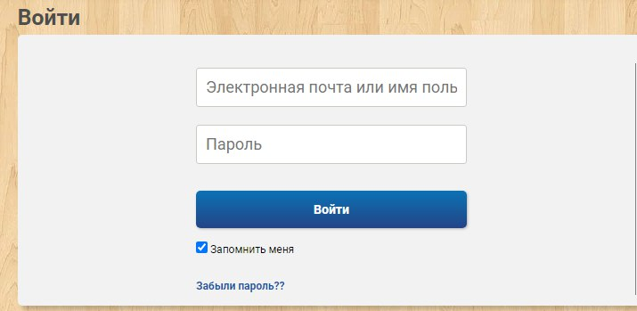
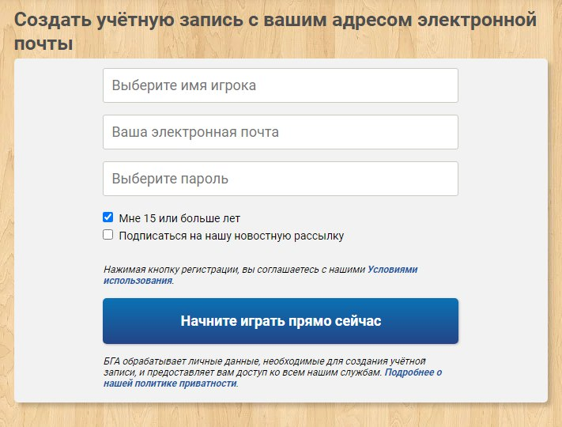
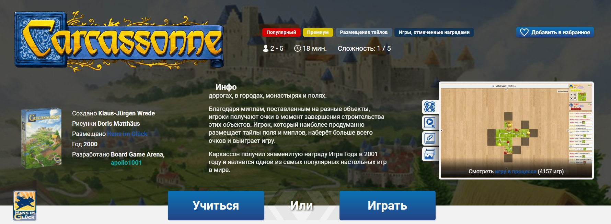
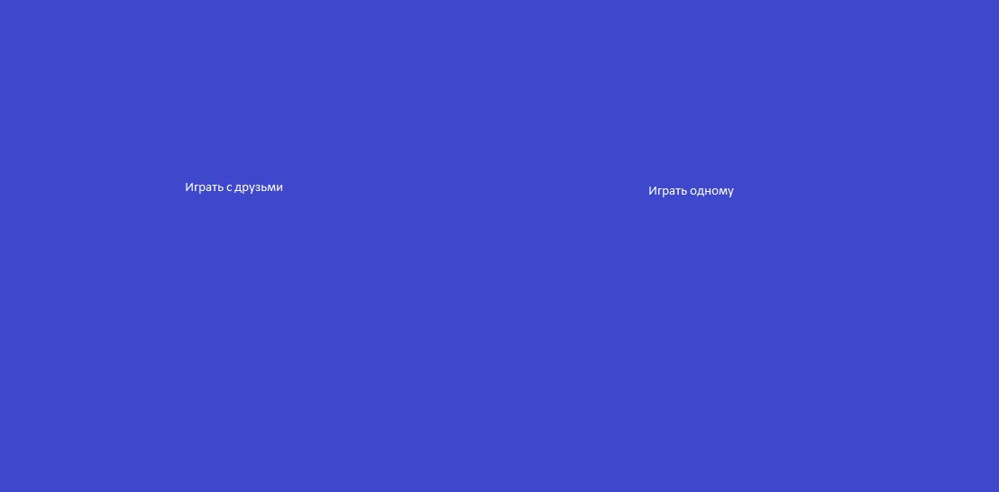
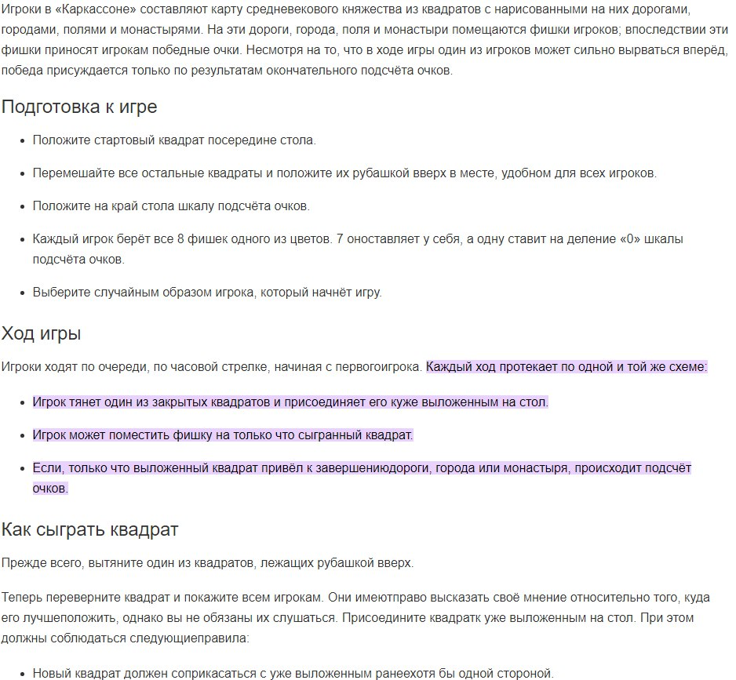
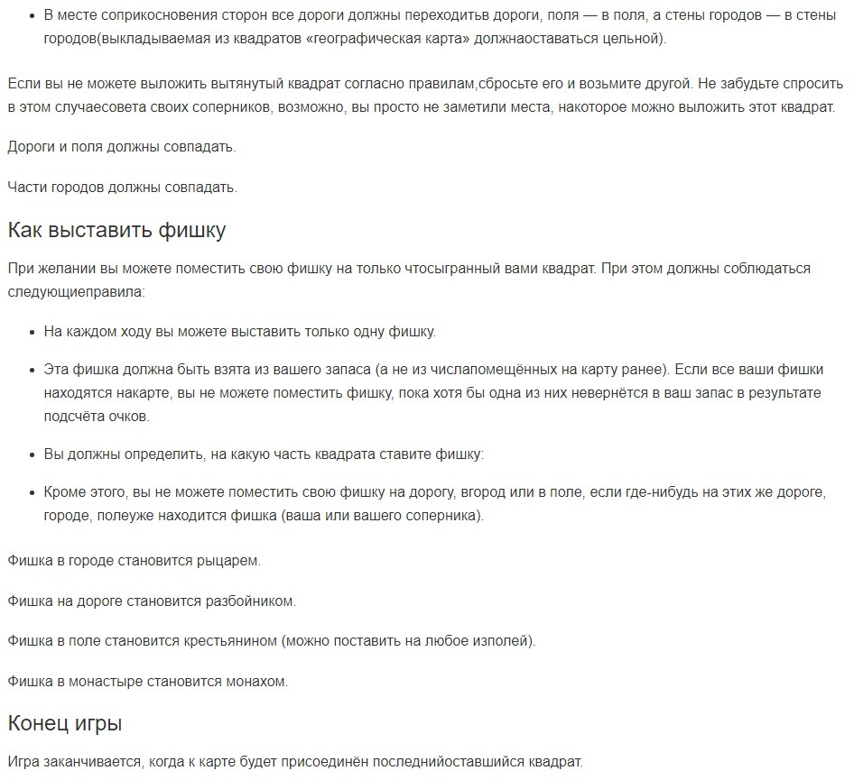

# Требования к проекту
# Содержание
1 [Введение](#intro)  
1.1 [Назначение](#appointment)  
1.2 [Бизнес-требования](#business_requirements)  
1.2.1 [Исходные данные](#initial_data)  
1.2.2 [Возможности бизнеса](#business_opportunities)  
1.2.3 [Границы проекта](#project_boundary)  
1.3 [Аналоги](#analogues)  
1.3.1 [Отличия от аналогов](#analogues_differences)  
2 [Требования пользователя](#user_requirements)  
2.1 [Программные интерфейсы](#software_interfaces)  
2.2 [Интерфейс пользователя](#user_interface)  
2.3 [Характеристики пользователей](#user_specifications)  
2.3.1 [Классы пользователей](#user_classes)  
2.3.2 [Аудитория приложения](#application_audience)  
2.3.2.1 [Целевая аудитория](#target_audience)  
2.3.2.1 [Побочная аудитория](#collateral_audience)  
2.4 [Предположения и зависимости](#assumptions_and_dependencies)  
3 [Системные требования](#system_requirements)  
3.1 [Функциональные требования](#functional_requirements)  
3.1.1 [Основные функции](#main_functions)  
3.1.1.1 [Вход пользователя в приложение](#user_logon_to_the_application)  
3.1.1.2 [Определение месторасположения и выбор дальнейшего действия](#locate_user)  
3.1.1.3 [Просмотр и редактирование профиля активного пользователя](#view_and_update_user)  
3.1.1.4 [Выбор данных для создания маршрута](#choose_information_about_trip)  
3.1.1.5 [Просмотр составленного маршрута](#preview_trip)  
3.1.1.6 [Навигация при прохождении маршрута](#navigate_user_during_trip)  
3.1.1.7 [Завершение маршрута](#finish_trip)  
3.1.1.8 [Статистика других игроков](#statistics_of_other_users)  
3.1.1.9 [Выход зарегистрированного пользователя из учётной записи](#active_user_change)
3.1.2 [Ограничения и исключения](#restrictions_and_exclusions)  
3.2 [Нефункциональные требования](#non-functional_requirements)  
3.2.1 [Атрибуты качества](#quality_attributes)  
3.2.1.1 [Требования к удобству использования](#requirements_for_ease_of_use)  
3.2.1.2 [Требования к безопасности](#security_requirements)  
3.2.2 [Внешние интерфейсы](#external_interfaces)  
3.2.3 [Ограничения](#restrictions) 

<a name="intro"/>

# 1 Введение

<a name="appointment"/>

## 1.1 Назначение
Документ разработан для однозначной трактовки требований между разработчиком и заказчиком. Необходимо разработать Web-приложение с простым функционалом и актуальной, проверенной информацией о маршрутах. В этом документе описаны функциональные и нефункциональные требования к Web-приложению «Каркассон». Этот документ предназначен для команды, которая будет реализовывать и проверять корректность работы приложения. 

<a name="business_requirements"/>

## 1.2 Бизнес-требования

<a name="initial_data"/>

### 1.2.1 Исходные данные
Всю историю человечества люди искали способы развлечь себя. Уже в XVIII-XIX вв люди начали играть в настольные игры. С развитием компьютерных технологий любимые игры стали появляться в Интернете и набрали огромную популярность. 

<a name="business_opportunities"/>

### 1.2.2 Возможности бизнеса
Многие люди в наше время желают поиграть в настольные игры,в частности каркассон,не отходя от компьютера. В связи с этим пояляется спрос на соответствующее приложение, а удобный интерфейс только увеличит количетсво желающих пользоваться именно этим приложением.

<a name="project_boundary"/>

### 1.2.3 Границы проекта
Приложение «Каркассон» предоставит зарегистрированным пользователям возможность ознакомится с правилами(поддержка новичков), создать свою игру(приватную и публичную), присоединиться к уже существующим играм. 

<a name="analogues"/>

## 1.3 Аналоги
Похожими на "Каркассон" играми являются "Каланизатор","Билет на поезд","Викинги","Остров Скай".

<a name="analogues_differences"/>

## 1.3.1 Отличия от аналогов
В отличие от наиболее близких (#analogues)аналогов - правила игры.

<a name="user_requirements"/>

# 2 Требования пользователя

<a name="software_interfaces"/>

## 2.1 Программные интерфейсы
Продукт должен являться Web-приложением и иметь user-friendly интерфейс. Front-end часть должна быть создана средствами HTML/CSS. Серверная часть должна быть написана на Java Servlets API.

<a name="user_interface"/>

## 2.2 Интерфейс пользователя
Окно входа в приложение.  

Окно регистрации нового пользователя.  
  

Главное окно приложения.  
  

Окно выбора режима игры.

Окно правил игры.

<a name="user_specifications"/>

## 2.3 Характеристики пользователей

<a name="user_classes"/>

### 2.3.1 Классы пользователей

| Класс пользователей | Описание |
|:---|:---|
| Зарегистрированные пользователи | Пользователи, которые вошли в приложение под своим логином (вымышленным уникальным именем пользователя), желающие составить маршрут и принять участие в соревновании по количеству пройденных километров |

<a name="application_audience"/>

### 2.3.2 Аудитория приложения

<a name="target_audience"/>

#### 2.3.2.1 Целевая аудитория
Люди молодой и средней возрастной категории, имеющие интерес к настольным играм. 

<a name="collateral_audience"/>

#### 2.3.2.2 Побочная аудитория
Люди старшей возрастной категории, обладающие вышеперечисленным качеством.

<a name="assumptions_and_dependencies"/>

## 2.4 Предположения и зависимости
1. Приложение не работает при отсутствии подключения к сети Интернет.

<a name="system_requirements"/>

# 3 Системные требования
